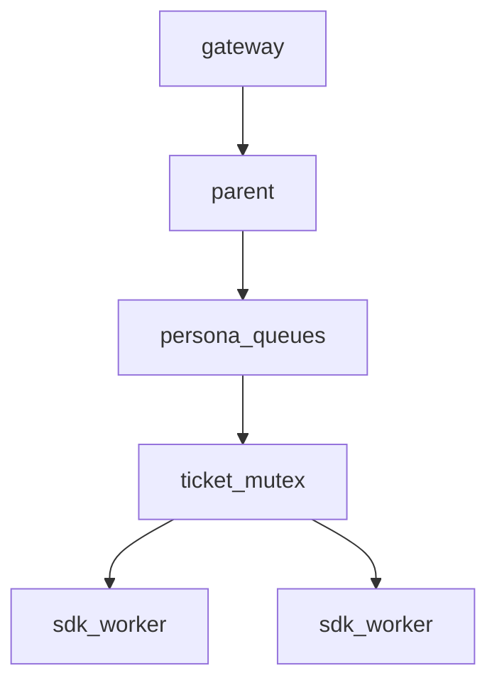

# Concurrency (단일 컨테이너)

GitHub는 Pod×N으로 격리 병렬. 여기는 **공유 cgroup + 공유 SDK pool**.

## 계약

1. **공유 pool** — `pool_size` 기본 2. persona별 pool 없음.
2. **티켓 뮤텍스** — `ticket_id`당 in-flight 1. `409` mutex/busy.
3. **persona 공정성** — `max_active_per_persona` 기본 **1**. pending은 persona 큐 → 라운드로빈.
4. **큐 상한** — `max_queue_per_persona` (기본 32). 초과 시 409 또는 drop+로그(구현 시 택1; 문서 기본은 409로 gateway retry).
5. **create storm** — 티켓당 짧은 창에 create만 쌓이면 429 `create_throttled`.
6. **스케줄/catch-up** — 같은 pool 소비. 장시간 NF는 detach로 slot 점유 금지.
7. **cwd** — worker 잡은 `workspaces/{persona}`; 동시 두 잡이 같은 persona cwd 금지(한도 1과 일치).

knobs: [../reference/concurrency-knobs.md](../reference/concurrency-knobs.md).
