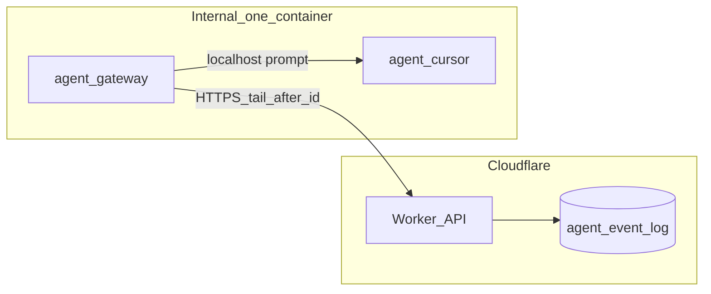

# Gateway topology

## 배치

내부망 **컨테이너 1개**에 gateway 프로세스와 [agent/cursor](../../cursor/)가 공존한다. Worker(Cloudflare)는 공인 API만 노출하고 내부망으로 push하지 않는다.

## 네트워크

| 방향 | 허용 |
|------|------|
| gateway → Worker | HTTPS (event tail, 선택적 health) |
| gateway → cursor | loopback HTTP만 (외부에 runner URL 노출 안 함) |
| Worker → gateway | **금지** (내부망 unreachable) |
| cursor → Worker | HTTPS (MCP/세션; gateway 경유 아님) |

## 데이터 (PVC)

checkpoint·retry는 `/data/gateway/`만 사용. persona workspace와 섞지 않는다 — [cursor PVC](../../cursor/docs/04-pvc-layout.md).

## GitHub 매핑

| GH | 여기 |
|----|------|
| Leantime Pod + plugin in-process Bridge | 별도 gateway 프로세스 + outbound pull |
| `runner_url` ClusterIP per agent | `http://127.0.0.1:{cursor_port}` 하나 |
