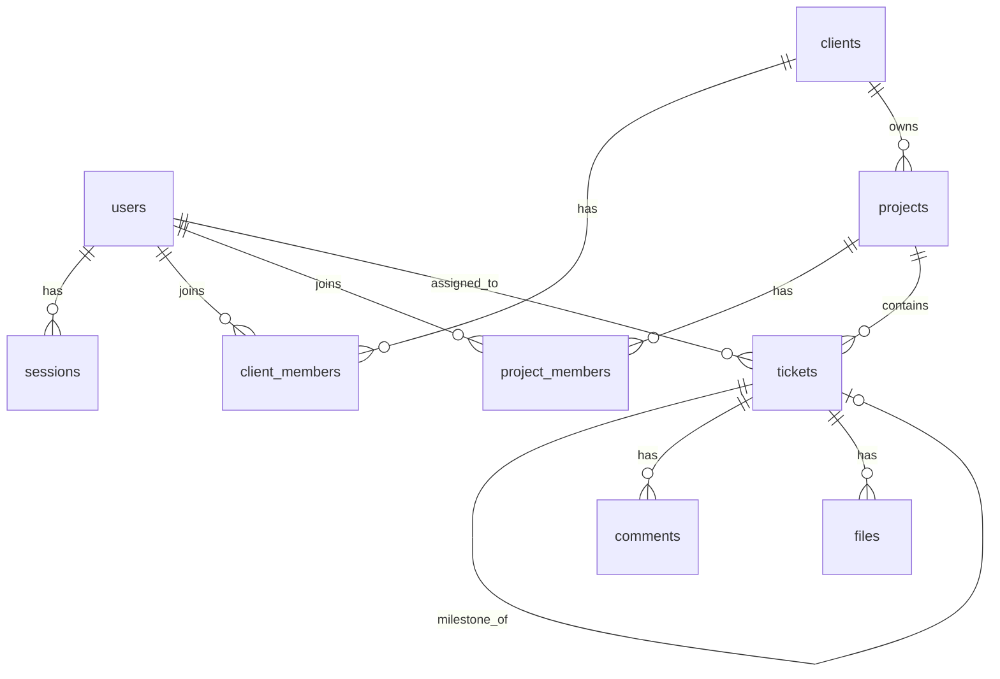

# Backend Design

Hono Worker API. 계약 정본: [ARCHITECTURE.md](../ARCHITECTURE.md).  
SPA IA: [frontend/ia/](../frontend/ia/).

스키마·REST 정본은 ARCHITECTURE. 이 문서는 도메인 범위·모듈 경계·설계 근거.

## Layout

- `src/index.ts` — Hono app + 시드 admin + `scheduled` (만료 세션 정리)
- `src/env.ts` — Env 타입
- `src/lib/` — crypto, ids, cookies, seed-admin
- `src/middleware/auth.ts` — 세션 로드
- `src/routes/` — auth, admin, clients, projects, tickets, comments, files, agent
- `src/lib/agent-events.ts` — `agent_event_log` append 헬퍼
- `src/lib/mentions.ts` — comment `@Name` → `mention_user_ids` (project member, case-insensitive)
- `tests/` — Vitest (workers pool)

## Commands

```bash
# from repo root
npm test
npm run db:migrate:local
npm run dev
```

---

## 1. 설계 원칙

| 선택 | 이유 |
| --- | --- |
| REST `/api/{resource}` | SPA·캐시·HTTP 의미에 맞음 |
| 세션 쿠키 + D1 `sessions` | 브라우저 1st-party UI 우선 (계약 §2) |
| D1 TEXT UUID PK | 분산·병합·클라이언트 생성에 유리 |
| `project_statuses` (프로젝트별 key/label/category) | 보드 UX와 1:1; 프로젝트별 커스텀 |
| `entity_type` + `entity_id` | 코멘트·파일 폴리모픽 첨부 |
| R2 + `files` 메타 | 계약 §5; D1에 blob 금지 |
| `client_members` N:M | 멀티 클라이언트 |
| `project_members` + `owner`\|`member` | 역할 단순화 |
| `routes/` + 얇은 쿼리/가드 | 두꺼운 서비스 레이어 없음 |

**Fail-closed:** 멤버십 없으면 403.

---

## 2. 도메인 범위

| 도메인 | 채택 | 대응 | 비고 |
| --- | --- | --- | --- |
| users / auth | **Adopt** | `users`, `sessions`, `/api/auth/*`, `/api/admin/users` | 2FA·LDAP 제외. `is_admin` 시드 |
| clients | **Adopt** | `clients`, `client_members` | |
| projects | **Adopt** | `projects`, `project_members` | |
| tickets | **Adopt** | `tickets` | type·status·milestone·assignee·due_at·priority·version |
| comments | **Adopt** | `comments` | ticket만; 스레드 Defer |
| files | **Adopt** | `files` + R2 | Direct Presigned Upload |
| ticket_activities | **Adopt** | `ticket_activities` | 필드 변경 이력 (M8) |
| agent_event_log | **Adopt** | `agent_event_log`, `GET /api/agent/events` | agent wake outbox (A1); UI History와 분리 |
| sprints | **Defer** | — | ROADMAP 후순위 |
| timesheets | **Exclude** | — | |
| calendar / notifications | **Exclude** | — | |
| canvas / ideas / wiki / goals | **Exclude** | — | |
| plugins / 전역 settings | **Exclude** | — | |
| 전역 RBAC / 계정별 CRUD 매트릭스 | **Exclude** | `is_admin` + `owner`\|`member`만 | |
| 전역 audit | **Exclude** | — | 티켓 이력만 유지 |
| access_tokens / PAT | **Exclude** | — | 세션만 |

### 2.1 티켓 이력 vs 전역 audit

| | `ticket_activities` | 전역 audit |
| --- | --- | --- |
| 범위 | **티켓 전용** 필드 변경 | 앱 전역 엔티티 활동 |
| UI | Issue History 탭 | Activity feed (없음) |
| 상태 | **구현됨** (M8) | Exclude |

컬럼: `ticket_id`, `actor_id`, `field`, `old_val`, `new_val`, `at`.

---

## 3. DB 스키마 설계

### 3.1 ER



### 3.2 테이블 요약

승격된 DDL은 ARCHITECTURE §3이 정본. 설계 요지:

| 테이블 | 핵심 |
| --- | --- |
| `users` | `id` UUID, `email` UNIQUE, `password_hash`, `name`, `is_admin` 0\|1 |
| `sessions` | opaque cookie `id`, `user_id`, `expires_at` |
| `clients` | `name`, `description`, `created_by` + `client_members`(role) |
| `projects` | `client_id` NOT NULL + `project_members`(role ∈ {owner, member}; optional `lane` ∈ {pm,ta,qa,aa,km,developer}) |
| `project_statuses` | 프로젝트별 칸반 컬럼 (`key`/`label`/`category` backlog\|active\|done / `sort_order`); 생성 시 v1 기본 9개 시드 |
| `tickets` | `type` task\|milestone; `status` = `project_statuses.key`; `priority`; `sort_order`; `milestone_id`; `assignee_id`; `due_at`; `date_from`/`date_to`; `version`; `created_by` |
| `comments` | `entity_type`+`entity_id` (MVP: ticket), `body`, `author_id` |
| `files` | `entity_type`+`entity_id`, `r2_key`, `filename`/`mime`/`size`, `uploaded_by` |
| `ticket_activities` | 티켓 필드 변경 로그 |
| `agent_event_log` | agent wake outbox (티켓/코멘트 mutate append; `ticket_id` FK 없음) |

칸반: 컬럼 = `project_statuses` 정렬순. `category=done`은 기본 최근 N일 필터.  
타임라인: `date_from`/`date_to` NOT NULL (`GET …/timeline`).

### 3.3 Exclude / Defer

**Exclude:** timesheets, calendar, notifications, canvas/ideas/wiki/goals, plugins, 전역 settings, PAT, 계정별 CRUD 매트릭스·전역 audit.  
**Defer:** sprints, 코멘트 스레드.

### 3.4 인덱스 (설계)

- `sessions(user_id)`
- `client_members(user_id)`, `project_members(user_id)`
- `projects(client_id)`
- `tickets(project_id, status, sort_order)`, `tickets(project_id, type)`, `tickets(milestone_id)`
- `tickets(assignee_id)`, `tickets(due_at)`
- `comments(entity_type, entity_id)`, `files(entity_type, entity_id)`

---

## 4. API 표면

프로토콜은 REST만. 상세 계약은 ARCHITECTURE §4.

### 4.1 Auth / Users

| REST | 비고 |
| --- | --- |
| `POST /api/auth/login` | 세션 발급 |
| `POST /api/auth/register` | |
| `POST /api/auth/logout` | |
| `GET /api/auth/me`, `PATCH /api/users/me` | name/email. `user.is_admin` |
| `POST /api/auth/password` | `{ current_password, new_password }` |
| `GET /api/users/search?q=` | name/email 타입어헤드. `q` ≥ 2, `limit` ≤ 20 |
| `GET /api/admin/users`, `PATCH /api/admin/users/:id` | 플랫폼 admin만. `{ is_admin }` |
| `GET /api/search?q=` | 멤버십 범위 Issues/Projects/Spaces |

### 4.2 Clients

| REST | 비고 |
| --- | --- |
| `GET/POST /api/clients` | 목록 / 생성(**admin만**, 생성자=owner) |
| `GET/PATCH/DELETE /api/clients/:id` | 삭제=owner (projects CASCADE) |
| `GET /api/clients/:id/projects` | |
| `GET/POST /api/clients/:id/members` | POST `{ user_id?, email?, role }` — owner만 |
| `DELETE /api/clients/:id/members/:userId` | owner만 (마지막 owner 보호) |

### 4.3 Projects

| REST | 비고 |
| --- | --- |
| `GET/POST /api/projects`, `GET/PATCH/DELETE /api/projects/:id` | 생성 시 `client_id`+멤버십+기본 statuses 시드; 삭제=owner |
| `GET/POST /api/projects/:id/members` | POST `{ user_id?, email?, role, lane? }` — project owner; client 멤버여야 함 |
| `PATCH /api/projects/:id/members/:userId` | `{ role?, lane? }` — owner; 마지막 owner 강등 불가 |
| `DELETE /api/projects/:id/members/:userId` | 마지막 owner 보호 |
| `GET/PUT /api/projects/:id/statuses` | 칸반 컬럼; PUT=owner (`migrate`로 티켓 재매핑) |

### 4.4 Tickets

| REST | 비고 |
| --- | --- |
| `GET /api/tickets/:id` | |
| `POST /api/projects/:id/tickets` | title, type, … |
| `PATCH /api/tickets/:id` | status/sort/priority/assignee/due/`version` → 409 |
| `GET /api/projects/:id/tickets` | type, status, assignee_id, created_by, limit, cursor |
| `GET /api/projects/:id/kanban` | `{ columns, statuses }`; 기본 최근 14일 `category=done` |
| `GET …/timeline` | |
| `DELETE /api/tickets/:id` | 작성자 또는 project owner |
| `GET /api/tickets/:id/activities` | 이력 |

### 4.5 Comments / Files

| REST | 비고 |
| --- | --- |
| `GET/POST /api/tickets/:id/comments` | |
| `PATCH /api/comments/:id` | 작성자 또는 owner; **이벤트 미적재** |
| `DELETE /api/comments/:id` | 작성자 또는 project owner |
| `POST /api/tickets/:id/files` | multipart (소용량) |
| `POST …/files/upload-url` · `…/confirm` | Presigned Direct Upload |
| `GET`/`DELETE /api/files/:id` | |

### 4.6 Agent outbox

| REST | 비고 |
| --- | --- |
| `GET /api/agent/events` | `after_id`, `limit`; 세션 필수; mutate append는 tickets/comments 경로 |
| `GET /api/agent/flow-gates` | `{ in_progress, flow_active }` EXISTS; 세션 필수 |

### 4.7 에러

| HTTP | 의미 |
| --- | --- |
| 401 | 세션 없음/만료 |
| 403 | 비멤버·권한 부족 |
| 404 | 없음 |
| 409 | 낙관적 락 충돌 |
| 400 | 검증 실패 |

---

## 5. 권한 모델

| 범위 | 역할 |
| --- | --- |
| 플랫폼 | `users.is_admin` (시드 1명+) |
| Client | `client_members.role` (`owner`, `member`) |
| Project | `project_members.role` (`owner`, `member`) + optional `lane` (`pm`\|`ta`\|`qa`\|`aa`\|`km`\|`developer`) |
| 계정별 CRUD | 없음 |

1. **Space 생성:** `is_admin`만. 가입 계정은 초대 전까지 멤버십 없음  
2. **Client:** 멤버십 필수; 삭제·멤버 관리 = `owner`만  
3. **Project:** 멤버십 필수; 생성 시 client 멤버; 삭제·멤버 관리 = `owner`만  
4. **Ticket/Comment/File 읽기·생성:** project 멤버  
5. **Ticket 수정:** project 멤버 + `version`  
6. **Ticket 삭제:** 작성자 또는 project `owner`  
7. **Comment/File 삭제:** 작성자(업로더) 또는 project `owner`
7b. **Comment PATCH:** 작성자 또는 project `owner` (이벤트 없음)

---

## 6. Worker 모듈 구조

```
backend/src/
  index.ts              # 앱 마운트
  middleware/auth.ts    # 세션 → user, 멤버십 가드
  routes/
    auth.ts
    admin.ts              # GET/PATCH /api/admin/users
    clients.ts
    projects.ts
    tickets.ts          # kanban + timeline + activities + agent append
    comments.ts         # agent append on create
    files.ts
    agent.ts            # GET /api/agent/events
  lib/
    agent-events.ts     # appendAgentEvent
    seed-admin.ts       # ADMIN_EMAIL/PASSWORD 시드
```

가드 순서: 세션 → 리소스 load → membership → owner/creator 검사 → 변이.

---

## 7. 구현 현황

| 항목 | 상태 | 로드맵 |
| --- | --- | --- |
| Auth / Clients / Projects / Tickets / Comments / Files 기본 | **구현됨** | M0–M5 |
| Client / Project 멤버 관리 | **구현됨** | M6 |
| assignee / due_at / priority / 삭제 가드 | **구현됨** | M6 |
| Cursor 페이징 · Done 기간 필터 · Presigned upload · 세션 Cron | **구현됨** | M7 |
| `version` 409 · `ticket_activities` | **구현됨** | M8 |
| `agent_event_log` · `GET /api/agent/events` | **구현됨** | A1 |
| `GET /api/agent/flow-gates` · comment PATCH | **구현됨** | A8–A9 |
| 플랫폼 admin · Space 생성 가드 | **구현됨** | M9 |
| `project_statuses` · 동적 칸반 | **구현됨** | M10 |
| timesheets, calendar, notifications, canvas/ideas/wiki/goals, plugins, PAT | **Exclude** | — |

범위 변경 시: 이 문서 §2–§4 → ARCHITECTURE 승격 → TDD.

---

## 8. 유지 규칙

1. **계약 변경** = ARCHITECTURE만 수정.  
2. 도메인 범위·모듈 경계가 바뀌면 이 문서를 갱신한다.  
3. 스키마/REST 목록 정본은 ARCHITECTURE; 여기와 중복 기재하지 않는다.
