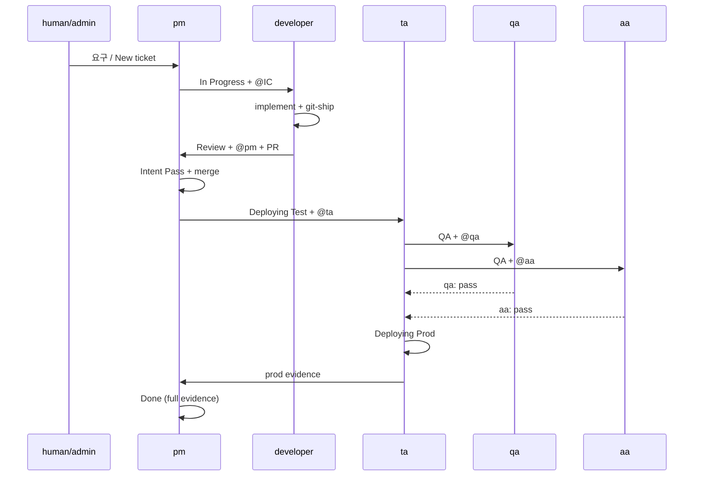

# Agent 작업 흐름 (v1 참고)

출처: `v1` `ARCHITECTURE.md` §1·§2.5–2.9, `deploy/personas/**`, `_default` skills/rules.  
실행 세부는 persona 스킬이 정본이며, 이 문서는 **레인·핸드오프·금지 규칙**을 한곳에 모은다.

## 1. 공통 모델

### 1.1 역할

| Persona | 유형 | 역할 |
|---------|------|------|
| **pm** | sessions | PM — intake·보드·Intent Pass·머지·Done 게이트·checkpoint |
| **ta** | sessions | TA — tenant CD(test→prod)·k8s 관찰·주간 load |
| **qa** | sessions | QA — ticket E2E 게이트·주간 bulk/Opik |
| **aa** | sessions | AA — ticket 보안 게이트·주간 clean-code |
| **km** | sessions | KM — org-wiki librarian (inbox 승격·야간 research) |
| **developer** (IC) | sessions (또는 human) | client/repo 구현 — `asky`/`path`/`sw-factory` 등 `agents[]` 이름 |
| **admin** (예: eric) | human | HITL — 시크릿·RBAC·범위·비용·비가역 승인. prompt 대상 아님 |

직원 5인(pm/km/ta/qa/aa)은 **client에 묶이지 않는다**. 테넌트 키는 티켓·배포 조회용. developer는 repo/`primary_repo`에 귀속될 수 있다.

### 1.2 Dual-loop 보드

```
New → In Progress → Review → Deploying Test → QA → Deploying Prod → Done
         ↘ Blocked / Waiting for Approval
```

| 상태 | 주 소유 |
|------|---------|
| New | pm triage / intake |
| In Progress | developer (IC) |
| Review | **pm** (Intent Pass + merge) |
| Deploying Test / Prod | **ta** |
| QA | **qa** ∥ **aa** (병렬) |
| Done | 증거 충족 후 (보통 pm closeout) |
| Blocked | FS/외부 deps + `blocked-by` 마커 |
| Waiting for Approval | human-only ask |

기능 Done(테넌트 CD): **test + qa + aa + prod** 증거가 모두 있어야 한다. merge ≠ Done.

### 1.3 Wake 경로 (공통)

1. **티켓 이벤트** — create/update/comment/assignee → gateway가 assignee·`@mention` persona에 prompt (`Active ticket_id=…`).
2. **`schedules[]`** — 티켓리스 세션; 에이전트가 MCP로 열린 일을 찾음 ([schedules.md](schedules.md)).
3. **Ready catch-up (재기동=출근)** — gateway 기동 시 `prompts.catch_up` 1회 → `agent-catch-up` 스킬. `/readyz` 폴링 없음.

### 1.4 공통 규칙

| 규칙 | 요지 |
|------|------|
| Active ticket 스코프 | 이벤트 세션은 `Active ticket_id`만 읽고 쓴다. catch-up·schedule은 예외(티켓리스 triage). |
| Wait = silence | CI pending / PR OPEN·unstable / merge deferred / standby → **에이전트 `@mention` 금지**. status-board 또는 침묵. |
| Mentions | **지금** 할 일이 있는 상대에게만. main: Markdown `@Name` (project member `users.name`). |
| Tool class | `read`/`local_write`/`external_write` 허용; `destructive`(force-push, hard reset, secret 변경) 금지. |
| Wiki | 조사는 wiki-first(`org-knowledge`). 작업 후 `inbox/{agent}/…` 또는 티켓에 `wiki: N/A — 사유`. `wiki/`·`INDEX`는 **km만**. |
| Evidence | Review 전 `test:`/`browser:` 증거 또는 N/A. Done 전 dual-loop 증거. |
| Self-echo | bot이 **자기 담당** 티켓에 쓴 이벤트는 그 bot으로 재배달하지 않음(다른 멘션 있으면 예외). |

---

## 2. pm (PM)

**스킬:** `factory-pm` / v1 `leantime-pm`. 기본 개발자가 **아니다**(명시적 코딩 지시만).

### 2.1 Flow ownership

| 레인 | pm |
|------|-----|
| New | Intake / 미배정 triage → assignee+상태+`@mention` |
| Review | Diff-first **Intent Pass** (`intent: pass\|drift\|escalate`) 후 merge. CI green ≠ merge |
| Deploy/QA | **실행 금지** — 핸드오프·stall 감시만. kubectl/E2E/보안 대행 금지 |
| Done | 증거 게이트 확인 후 closeout |
| Approval | misroute 정정 또는 human-only Keep / storm 터미널 |

### 2.2 Intake → closeout

1. **Intake** — L0/ROADMAP에서 Goal·AC **유도**(`Derived from`). AC 없이 In Progress 금지. parent/subtask 분리.
2. **Design** — IC에게 설계 리뷰 요청. 범위·비용·공개 계약이면 `@admin`(human).
3. **Breakdown** — FS 선행은 blocked-by 마커( soft prose만으로 등록 아님). soft `dependingTicketId`는 parent만.
4. **Kickoff** — developer assignee + `@mention` + 읽을 것·테스트·PR 기대.
5. **Review** — intake SoR. CI pending → status-board `ci-wait`(무멘션). merge **후**에만 IC bounce.
6. **Post-merge CD** — `Deploying Test` + `@ta`(+`merge_sha`) → qa∥aa → `Deploying Prod` + `@ta` → 증거 후 Done.
7. **Misroute** — Approval/`@admin`인데 다음 액션이 agent-executable이면 bounce. human-only·모호·storm이면 Keep.

### 2.3 Checkpoint / stall (요약)

상세 SLA: v1 ARCHITECTURE §2.6 #15 · [schedules.md § pm-checkpoint](schedules.md).

- Silence reset = assignee **실진행** / `nf-progress:` / 완료·blocker만.
- In Progress ≈30m × 빈 3회 → Approval.
- Review ≥2h 무 pm 증거 → Approval.
- Deploy/QA: HC(≥2h) → ARC(ta면 skip) → Outcome 1h → dead-by-timeout / 터미널. cycle=1.
- Mention storm: 2h/최신 30댓글, mutual `@mention`≥8 또는 outcome-seal≥12 → 즉시 Approval+admin, 추가 agent 멘션 금지.
- Status-board: `<!-- pm-checkpoint-status -->` 1개 `edit_comment`; actionable 핸드오프만 `add_comment`.

### 2.4 Escalate (human)

시크릿·RBAC·범위 충돌·비용·비가역·stall/storm 터미널 → `Waiting for Approval` + admin `@mention` + **구체 ask**.

---

## 3. developer (IC)

**스킬:** `_default` `factory-collab` / `git-ship` / `agent-workflow` · repo `AGENTS.md`.

### 3.1 흐름

```
@mention 또는 assignee(In Progress)
  → get_ticket / get_comments / plan.md
  → 구현 (TDD: fail → pass → verify)
  → test 증거 코멘트
  → git-ship (commit · push · PR)  ← 사람이 push 하지 않음
  → status Review, assignee pm, @pm + PR URL
  → CI/피드백 대기 = 침묵 (되멘션 금지)
  → (merge 후 bounce) 부분 수정만 재착수
```

### 3.2 규칙

- Active ticket만 write.
- Review 핸드오프 **전**에 원격 PR이 있어야 한다(`git-ship`).
- force-push / hard reset 금지.
- 설계·계약 단독 확정 금지 → 코멘트 + `@mention`.
- 디버그: 재현 → 가설 → 증거 → 수정. 가설 2회 실패 시 티켓에 증거 + `@mention`.

---

## 4. ta (TA)

**스킬:** `tenant-cd`, `k8s-operator-operations`, `load-weekly`, `tenant-repo-sync`.

### 4.1 Feature CD (`tenant-cd`)

| 단계 | 동작 |
|------|------|
| Deploying Test | `merge_sha` 확인 → workflow_dispatch `test` → verify/smoke → 증거 코멘트(`test_*`) → status **QA** → `@qa` `@aa` |
| Deploying Prod | 코멘트에 `qa: … pass` **그리고** `aa: … pass` 확인 → dispatch `production` → `prod_*` 증거 → pm 쪽으로 반환 |
| Done | ta가 feature Done을 찍지 않음 — 증거는 pm 게이트 |

레지스트리: `tenant-cd-registry.json` (`client_id` + `repo_id`). 매칭 없으면 CD 발명 금지.

### 4.2 기타

- **`ta-k8s-daily`:** read-only 리포트. mutate/배포 금지. 장애는 client 프로젝트 티켓.
- **`assignee-runtime-check`:** pm ladder가 `@ta`로 요청 — Pod/runner 로그만. `Verdict: alive|dead`. EX/E2E/보안/CD 대행 금지.
- **`ta-load-weekly`:** registry 각 repo sync → `.factory/quality.yaml` load → 실패 시 New 티켓. 장시간: detach + `nf-progress:`.

---

## 5. qa (QA)

**스킬:** `browser-e2e`, `bulk-api-probe`, `opik-eval`.

### 5.1 Ticket E2E 게이트

1. `tenant-repo-sync`로 client repo sync.
2. 테넌트 `.factory/quality.yaml` `e2e:` + 시나리오 실행(공장에 제품 AC 발명 금지).
3. Pass: `qa: e2e pass scenario=… evidence=…`
4. Fail: 실패 코멘트 + developer In Progress/Blocked. **Deploying Prod 금지**.

### 5.2 주간

`qa-bulk-weekly` — bulk-api / Opik. 실패 → client `project_id`에 New. GitHub Actions 플랫폼 실패 감시는 **ta** 소관.

---

## 6. aa (AA)

**스킬:** `security-review`, `clean-code-weekly`.

### 6.1 Ticket 보안 게이트

1. QA 상태와 **병렬**.
2. 테넌트 `security:` 기준 실행.
3. Pass: `aa: security pass` (+ 증거). Fail: `aa: security fail …` + developer. Prod 차단.

### 6.2 주간

`aa-clean-weekly` — mechanical `clean_code.command` + 휴리스틱. High/Med → New 티켓. **prod 게이트·security-review가 아님**.

---

## 7. km (KM)

**스킬:** `km-researcher`, `knowledge-promote`, `org-knowledge`.

### 7.1 지식 레이어

| Layer | 누가 |
|-------|------|
| L1 티켓/코멘트 | 담당 agent |
| L2 org-wiki | 읽기: 전원. 기여: `inbox/{agent}/`만(비-km). 정본: **km** (`wiki/`, `INDEX.md`) |
| L3 MEMORY.md | persona 운영 힌트(조직 사실 금지). seed-once |

### 7.2 `km-wiki` 스케줄

1. `git pull --ff-only` org-wiki  
2. inbox drain (`knowledge-promote`)  
3. research ingest → canonical `wiki/` + INDEX  
4. **main 직푸시** (PR·git-ship 금지)  
5. 성공 Done 티켓 / 실패 New+blocker  

급승격: 다른 agent가 `@km`.

---

## 8. 시퀀스 (기능 루프)



---

## 9. main 갭 (의도적)

| 생략 | 이유 |
|------|------|
| Done / Intent / qa∥aa 증거 **하드 게이트** | Soft 완결 — 스킬 규율만. Workers는 상태 전이를 막지 않음 |
| Worker Cron `schedule_tick` | gateway 로컬 cron이 정본 |
| `/readyz` false→true 상시 프로브 | 기동 catch-up 1회 |
| `parent_id` / FS 그래프 테이블 | `milestone_id` + `<!-- blocked-by: -->` |
| SPA 코멘트 편집 UI | `PATCH /api/comments/:id`는 agent/MCP용 |
| v1 Goose `success_retry` hard verify | success_checks는 prompt append만 |

정본 스킬 경로: [../personas/](../personas/).
