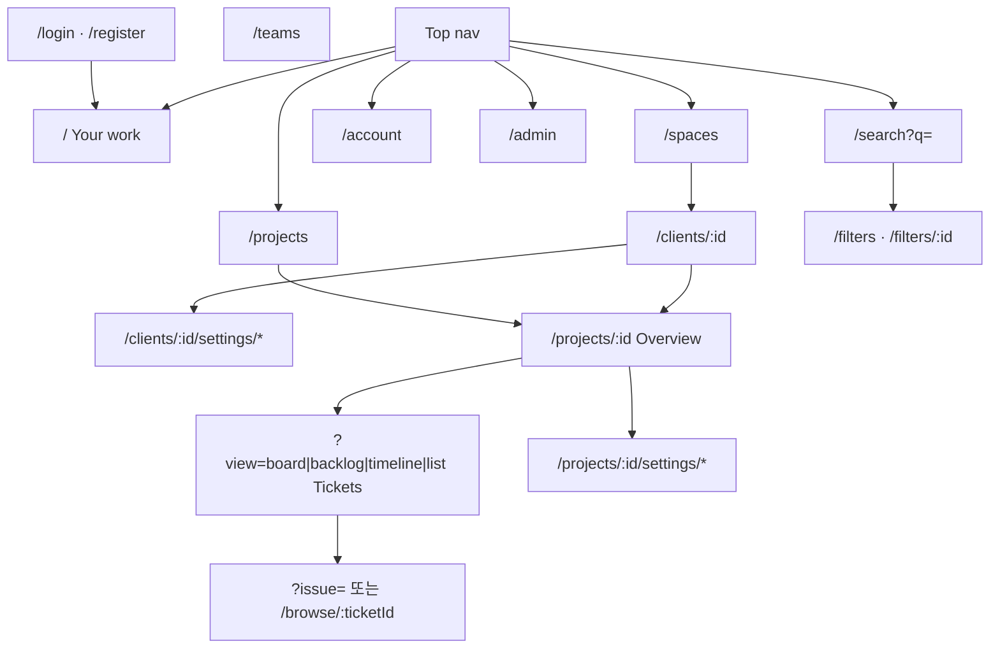

# Frontend — Overview (Prod)

## 1. 제품 원칙

| 축 | 선택 |
| --- | --- |
| 무엇을 | Space(Client)·Project·Board/Backlog/Timeline/List·Issue·관리 |
| 어떻게 | Top nav·Create·보드·이슈 패널·Project settings 중심 SPA |
| 데이터 | backend REST + 세션 쿠키만 |
| 권한 UI | 플랫폼 `is_admin`(Space 생성·계정 목록) + Space/Project `owner` \| `member` |

사용성: 탑바 Create → 보드 드래그 → 이슈와 보드 동시(논모달 인스펙터) → Esc/바깥 클릭 → 최근·검색·멤버 관리까지 한 제품 흐름. Board/Backlog/Timeline in-view 생성은 보류.  
디자인 시스템·토큰·인터랙션 표준: [design-system.md](design-system.md).

## 2. 공통 크롬

```
┌─ Top nav (전역, 48px 클린 라이트 크롬) ──────────────────────────┐
│ Logo │ Spaces │ Projects │ Your work │ [Create] [Search ⌘K] [Avatar ▾] │
├─ (Space/Project 진입 시 Side) ──────┬─ Main ────────────────────────┤
│ Back · Space Switcher              │ Overview: 이름·설명·수행 중  │
│ Overview · Tickets                │ Tickets: [Board|Backlog|…]    │
│ Space/Project settings              │ Filter/Search                  │
└────────────────────────────────────┴────────────────────────────────┘
```

- **Overview vs Tickets:** Overview는 프로젝트 랜딩(이름·설명·수행 중 티켓). 4대 뷰(`Board | Backlog | Timeline | List`)는 Tickets 툴바 세그먼트만 — 사이드바에 4뷰를 두지 않는다.
- **스페이스 스위처:** 프로젝트 사이드바에 모든 전역 스페이스를 덤프하지 않고, 사이드바 상단 콤보박스 스위처로 압축한다.
- **설정 전용 셸:** `/projects/:id/settings/*` 진입 시 이중 사이드바 병렬 노출을 방지하고 설정 전용 단일 사이드바/전환 레이아웃을 사용한다.
- **전역 화면:** (`/`, `/projects`, `/spaces`, `/search`, `/account`, `/admin`)에는 프로젝트 사이드바를 두지 않는다.

세부 메뉴: [menus.md](menus.md). 화면: [pages.md](pages.md). 관리: [admin.md](admin.md). 디자인 시스템: [design-system.md](design-system.md).

## 3. 정보 구조 (라우트 맵)



| 경로 | 역할 | 문서 |
| --- | --- | --- |
| `/login`, `/register` | 인증 | pages F1 |
| `/` | Your work (홈) | F3 |
| `/your-work` | `/`로 리다이렉트 | F3 |
| `/projects` | Projects 목록 (`GET /api/projects`) | F2 |
| `/spaces` | Spaces 목록 (`GET /api/clients`) | F2b |
| `/clients/:id` | Space hub | F4 |
| `/clients/:id/settings/*` | Space 관리 | admin |
| `/projects/:id` | Project Overview | F4b |
| `/projects/:id` + `?view=` | Tickets 작업 뷰 | F5–F8 |
| `/projects/:id/settings/*` | Project 관리 | admin |
| `/browse/:ticketId` | Issue 전체 페이지 | F9 |
| `?issue=` | Issue sidebar/modal | F9 |
| `/filters`, `/filters/:id` | 저장 필터·결과 | F10 |
| `/teams` | 사람·멤버십 디렉터리 | F12 |
| `/search` | 전역 검색 | F13 |
| `/account` | 내 계정 | admin |
| `/admin` | 플랫폼 Admin (계정 목록·Space 생성) | admin |

## 4. status · type

칸반 `status`는 **프로젝트별** `project_statuses.key`(고정 enum 아님). 기본 시드:

| UI | `key` | `category` |
| --- | --- | --- |
| Backlog | `backlog` | backlog |
| In Progress | `in_progress` | active |
| Review | `review` | active |
| Deploying Test | `deploying_test` | active |
| QA | `qa` | active |
| Deploying Prod | `deploying_prod` | active |
| Done | `done` | done |
| Blocked | `blocked` | active |
| Waiting for Approval | `waiting_for_approval` | active |

owner는 Project settings → Board에서 추가·이름·순서·삭제(`PUT …/statuses`).

| UI | `type` |
| --- | --- |
| Task | `task` |
| Milestone | `milestone` |

## 5. Backend 의존 · 승격 필드

Prod UI가 요구하는 항목의 백엔드 승격 현황:

| UI 필요 | 설계 대응 | 상태 |
| --- | --- | --- |
| Your work / assignee | `tickets.assignee_id` | **구현됨** (M6) |
| due / priority 표시·필터 | `due_at`, `priority` | **구현됨** (M6) |
| Client/Project People | members list/add/remove/role API | **구현됨** (M6) |
| 티켓 삭제 권한 보호 | 작성자 또는 project owner만 | **구현됨** (M6) |
| 대용량 데이터 페이징 / 완료 필터 | Cursor 페이징, Done 기간 필터 | **구현됨** (M7) |
| 대용량 파일 첨부 | Direct upload-url / confirm | **구현됨** (M7) |
| 동시 편집 충돌 방지 | `version` 낙관적 락 | **구현됨** (M8) |
| Filters 저장 | localStorage (`lt_saved_filters`) → 이후 `saved_filters` 서버 | **FE5 local** |
| Issue History 탭 | `ticket_activities` | **구현됨** (M8, `GET …/activities`) |
| 전역 검색 | `GET /api/search` | **구현됨** (FE3) |
| Account 프로필·비밀번호 | `PATCH /api/users/me`, `POST /api/auth/password` | **구현됨** (FE3) |
| 플랫폼 Admin | `users.is_admin`, `GET/PATCH /api/admin/users`, Space 생성 가드 | **구현됨** (M9/FE7) |
| 프로젝트 칸반 컬럼 커스텀 | `project_statuses`, `GET/PUT …/statuses` | **구현됨** (M10/FE8) |
| Sprints 섹션 | sprints 도메인 | Defer |

Exclude 도메인 API는 만들지 않는다.

## 6. 모듈 구조 (코드 제안)

```
frontend/src/
  api/
  components/chrome/   TopNav, ProjectSidebar, SpaceSidebar, QuickCreate, Search
  components/issue/    IssuePanel, IssuePage
  pages/               Auth, YourWork, Projects, Space, ProjectShell, Filters,
                       Teams, Search, Account, settings/*
  views/               Board, Backlog, Timeline, List
```

Commands: [../DESIGN.md](../DESIGN.md).
