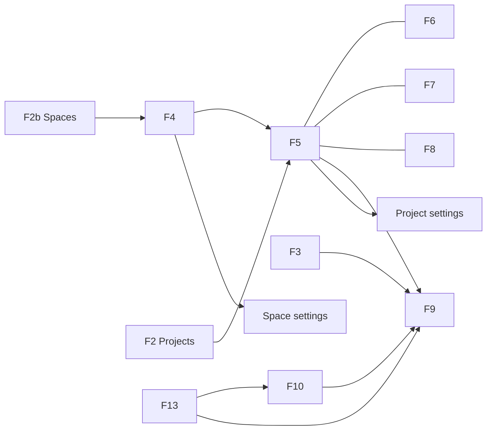

# Frontend — Pages (Prod)

각 화면: Layout · Behavior · Data/API · Connections.  
관리 전용 화면은 [admin.md](admin.md).

---

## F1. Auth — `/login`, `/register`

**Layout:** 중앙 폼 (email, password, register 시 name).  
**Behavior:** 성공 → `/` (또는 `?next=`). 실패 인라인.  
**API:** `POST /api/auth/login|register`, `GET /api/auth/me`.  
**Connections:** → Your work.

---

## F2. Projects — `/projects`

**Layout:** Top nav(사이드바 없음) + 제목 Projects + Create space · Create project + 테이블 (Name, Space, Role).  
**Behavior:** 행 → `/projects/:id?view=board` (Space hub 생략). Create space → `POST /api/clients` 후 hub (**admin만**); Create project → space 선택 후 `POST /api/projects`. 비admin·무멤버십 빈 화면: admin 초대 안내.  
**API:** `GET /api/projects`, `GET /api/clients`.  
**Connections:** → Project board. Top nav **Projects**.

---

## F2b. Spaces — `/spaces`

**Layout:** Top nav + 제목 Spaces + Create space(**admin만**) + Client 테이블 (Name, Role).  
**Behavior:** 행 → `/clients/:id`. 비admin은 Create space 없음.  
**API:** `GET/POST /api/clients`.  
**Connections:** → Space hub. Top nav **Spaces**.

---

## F3. Your work — `/` (alias `/your-work` → `/`)

**Layout:** 탭 또는 섹션 — Assigned to me | Created by me | Recently viewed | Recent projects.  
**Behavior:** 이슈 행 → `/browse/:id` 또는 프로젝트 보드+`?issue=`; 프로젝트 카드 → Board.  
**API:** `GET /api/projects`; tickets by `assignee_id=me` / `created_by=me` (ARCHITECTURE §4); recent은 클라이언트 저장.  
**Connections:** → Issue · Project board. Top nav **Your work**. 로그인·로고 홈.

---

## F4. Space hub — `/clients/:id`

**Layout:** Breadcrumb, Space 헤더(이름·설명·⚙️), Create project, People, 프로젝트 테이블 (Name, role).  
**Behavior:** 행 → `/projects/:id?view=board`; ⚙️ → settings; People → `.../settings/people`.  
**API:** `GET /api/clients/:id`, `GET …/projects`, `POST /api/projects`.  
**Connections:** → Project views · Space People.

---

## F5. Board — `/projects/:id?view=board`

**Layout:** 툴바(타이틀 + 세그먼트 탭 `Board|Backlog|Timeline|List` + 검색·•••) + 4컬럼 + 카드.  
**카드 규격:** 타입 아이콘 + 키(`MOB-F416`) + 우선순위 뱃지(High/Medium/Low 컬러 태그) + 2줄 말줄임 타이틀 + 마감일 태그 + 우측 정렬된 담당자 아바타.  
**Behavior:** 드래그 → `PATCH` `{ status, sort_order, version }`; 카드 클릭 → **논모달 사이드 인스펙터** 오픈; Group by(assignee/milestone/type) **Prod 포함**(클라이언트 그룹핑); 가로 스크롤 페이드 인디케이터. 티켓 생성은 탑바 **Create**(F14)만 — 컬럼 인라인 생성은 보류.  
**API:** `GET …/kanban` (최근 완료건 기본), `POST …/tickets`.  
**Connections:** → Issue.

---

## F6. Backlog — `?view=backlog`

**Layout:** 이슈 리스트(우선순위 뱃지, 키, 타이틀, 담당자, 상태 셀렉트) + Board issues 드롭 영역(안내 문구 포함). 빈 백로그는 EmptyState(제목+안내, CTA 없음). 티켓 생성은 탑바 **Create**(F14)만.  
**Behavior:** 행 → issue 인스펙터; 인라인 status 변경. Sprint 섹션은 Defer.  
**API:** `GET/POST/PATCH …/tickets`.  
**Connections:** → Issue.

---

## F7. Timeline — `?view=timeline`

**Layout:** 날짜 축 + `date_from`/`date_to` 간트 바; milestone 강조.  
**Empty State (필수):** 일정이 등록된 티켓이 없을 때 표준 `EmptyState`(아이콘 + 제목 + 가이드 문구). in-view 생성 CTA는 보류 — 티켓 생성은 탑바 **Create**(F14)만.  
**Behavior:** 클릭 → issue; 바 드래그로 기간 `PATCH` (**Prod**).  
**API:** `GET …/timeline`, `PATCH /api/tickets/:id`.  
**Connections:** → Issue.

---

## F8. List — `?view=list`

**Layout:** 테이블 Type | Title | Status(컬러 뱃지) | Assignee | Due | Priority(아이콘+태그) | Updated. 컬럼 표시 토글.  
**Behavior:** 행 → issue; 헤더 정렬(정렬 방향 화살표 표시); 필터 칩(status/type).  
**API:** `GET …/tickets`.  
**Connections:** → Issue.

---

## F9. Issue — `?issue=` / `/browse/:ticketId`

**Layout (Non-modal Inspector / Modal / Full):**

```
[ Type · Key · Status(커스텀 뱃지) · Priority(커스텀 뱃지) ]
[ Title (자동 개행 입력창, 클리핑 방지) ]
[ Description (리사이즈 텍스트에어리어) ]
[ Milestone · Dates · Assignee ]
[ Activity: Comments | History | Files ]
```

**인터랙션 규격:**
- **사이드 인스펙터 (`?issue=`):** 배경 딤(Backdrop) 없는 **논모달 패널**. 우측 480px 고정, 뒤쪽 보드/리스트와 실시간 동시 탐색 가능, 다른 카드 클릭 시 즉시 내용 갱신.
- **모달 (`?issue=&issueUi=modal`):** 중앙 집중 팝업 + 어두운 오버레이 딤.
- **전체 페이지 (`/browse/:ticketId`):** 독립 전체 화면.
- **Behavior:** 인라인 저장 `PATCH` (낙관적 락 `version`); 투박한 네이티브 `<select>` 대신 커스텀 상태/우선순위 팝오버; 댓글 CRUD; 파일 업로드/다운로드/삭제; 삭제 시 작성자/owner만 가능; Esc로 닫기.  
**API:** tickets, comments, files; History는 `GET /api/tickets/:id/activities`.  
**Connections:** ← Board · List · Search · Your work.

---

## F10. Filters — `/filters`, `/filters/:id`, `/filters/new`

**Layout:** 필터 목록(이름, starred, owner) / 빌더(project, type, status, assignee, text) / 결과 이슈 테이블.  
**Behavior:** 저장·복제·삭제·star; 결과 행 → issue.  
**Data:** Prod — localStorage (`lt_saved_filters`)로 저장·실행; 서버 `saved_filters` 승격은 후속.  
**API:** 실행은 `GET …/tickets` query (+ 클라이언트 text 필터).  
**Connections:** → Issue. Top nav에는 없음 — Search에서 **Saved filters**로 진입.

---

## F12. Teams — `/teams`

**Layout:** People 테이블 (name, email, Spaces/Projects 소속 요약). 검색.  
**Behavior:** 행 → 해당 사용자가 속한 Space/Project 목록 패널; Add to project(owner 컨텍스트).  
**API:** members 목록 API 보강(설계: `GET /api/people` = 내가 볼 수 있는 멤버 합집합).  
**Connections:** → Space/Project People. Top nav에는 없음 — Space hub **People**이 members API 화면.

---

## F13. Search — `/search?q=`

**Layout:** 통합 결과 섹션: Issues / Projects / Spaces.  
**Behavior:** Top nav 검색·⌘K → `/search?q=`; 디바운스 재조회; 행 → issue/project/space.  
**API:** `GET /api/search?q=` (ARCHITECTURE §4).  
**Connections:** → Issue · Project · Space. Saved filters → F10. Top nav Search.

---

## F14. Quick Create (모달, 전역)

**Layout:** 컴팩트 모달 (`max-width: 540px`). 빈 여백 낭비 없이 핵심 필드(Project, Work type, Summary, Description, Assignee, Priority)가 조화롭게 배치된 밸런스 그리드.  

| 필드 | 필수 | 비고 |
| --- | --- | --- |
| Project | ✓ | 현재 프로젝트 기본 선택 |
| Type | ✓ | Task / Milestone |
| Summary | ✓ | 한 줄 타이틀 |
| Priority | — | Medium 기본 |
| Assignee | — | 미지정 기본 |
| Description | — | 내용 입력 |
| Due date | — | 마감일 |

expand / dock(선택) / Esc. 성공 → 뷰 갱신 ± issue 오픈.

---

## F15. Create Space / Create project (모달)

- Space: name, description → `POST /api/clients` (**플랫폼 admin만**)
- Project: name, description, client_id 고정 → `POST /api/projects`

---

## 화면 연결 요약


