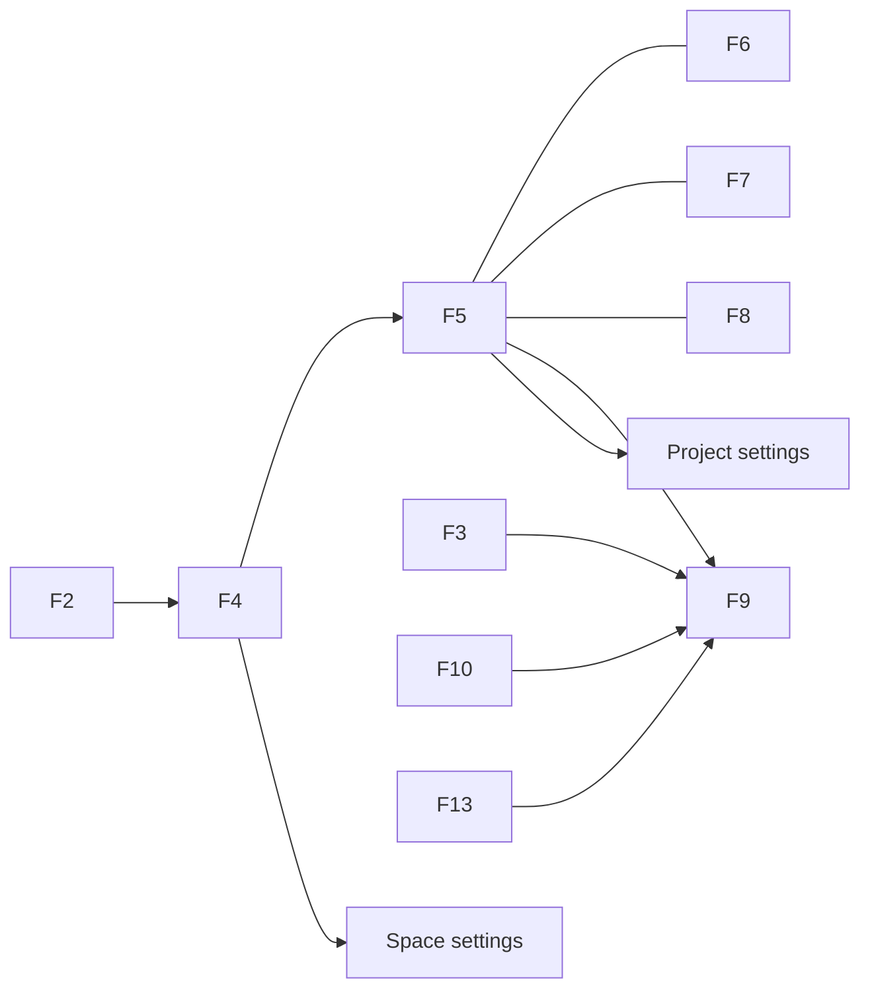

# Frontend — Pages (Prod)

각 화면: Layout · Behavior · Data/API · Connections.  
관리 전용 화면은 [admin.md](admin.md).

---

## F1. Auth — `/login`, `/register`

**Layout:** 중앙 폼 (email, password, register 시 name).  
**Behavior:** 성공 → `/` (또는 `?next=`). 실패 인라인.  
**API:** `POST /api/auth/login|register`, `GET /api/auth/me`.  
**Connections:** → Projects.

---

## F2. Projects — `/`

**Layout:** Top nav + 제목 Projects + Create project + Space(Client) 그리드/테이블 (Name, Description, Project count, Role).  
**Behavior:** 행 → `/clients/:id`; Create → Client 생성 모달. 검색/정렬.  
**API:** `GET/POST /api/clients`.  
**Connections:** → Space hub.

---

## F3. Your work — `/your-work`

**Layout:** 탭 또는 섹션 — Assigned to me | Recently viewed | Recent projects.  
**Behavior:** 이슈 행 → `/browse/:id` 또는 프로젝트 보드+`?issue=`; 프로젝트 카드 → Board.  
**API:** `GET /api/projects`; tickets by `assignee_id=me` (ARCHITECTURE §4); recent은 클라이언트 저장.  
**Connections:** → Issue · Project board.

---

## F4. Space hub — `/clients/:id`

**Layout:** Breadcrumb, Space 헤더(이름·설명·⚙️), Create project, 프로젝트 테이블 (Name, updated, role).  
**Behavior:** 행 → `/projects/:id?view=board`; ⚙️ → settings.  
**API:** `GET /api/clients/:id`, `GET …/projects`, `POST /api/projects`.  
**Connections:** → Project views.

---

## F5. Board — `/projects/:id?view=board`

**Layout:** Sidebar(Board) + 툴바(뷰·검색·•••) + 4컬럼 + 카드(title, type, assignee 아바타, priority 뱃지, due_at).  
**Behavior:** 드래그 → `PATCH` `{ status, sort_order, version }`; 컬럼 `+ Create`; 카드 → issue UI; Group by(assignee/milestone/type) **Prod 포함**(클라이언트 그룹핑).  
**API:** `GET …/kanban` (최근 완료건 기본), `POST …/tickets`.  
**Connections:** → Issue.

---

## F6. Backlog — `?view=backlog`

**Layout:** 이슈 리스트(정렬: status, sort_order, updated); 하단 `+ Create` (`status=backlog`).  
**Behavior:** 행 → issue; 인라인 status 변경. Sprint 섹션은 Defer.  
**API:** `GET/POST/PATCH …/tickets`.  
**Connections:** → Issue.

---

## F7. Timeline — `?view=timeline`

**Layout:** 날짜 축 + `date_from`/`date_to` 바; milestone 강조.  
**Behavior:** 클릭 → issue; 바 드래그로 기간 `PATCH` (**Prod**).  
**API:** `GET …/timeline`, `PATCH /api/tickets/:id`.  
**Connections:** → Issue.

---

## F8. List — `?view=list`

**Layout:** 테이블 Type | Title | Status | Assignee | Due | Updated. 컬럼 표시 토글.  
**Behavior:** 행 → issue; 헤더 정렬; 필터 칩(status/type).  
**API:** `GET …/tickets`.  
**Connections:** → Issue.

---

## F9. Issue — `?issue=` / `/browse/:ticketId`

**Layout (sidebar/modal/full):**

```
[ Type · Title · Status ]
[ Description ]
[ Milestone · Dates · Assignee · Priority ]
[ Activity: Comments | History | Files ]
```

**Behavior:** 인라인 저장 `PATCH` (낙관적 락 `version`); 댓글 CRUD; 파일 업로드/다운로드/삭제; 삭제 시 작성자/owner만 가능; Esc로 쿼리 제거(sidebar/modal).  
**API:** tickets, comments, files; History는 `GET /api/tickets/:id/activities`.  
**Connections:** ← Board · List · Search · Your work.

---

## F10. Filters — `/filters`, `/filters/:id`, `/filters/new`

**Layout:** 필터 목록(이름, starred, owner) / 빌더(project, type, status, assignee, text) / 결과 이슈 테이블.  
**Behavior:** 저장·복제·삭제·star; 결과 행 → issue.  
**Data:** Prod — localStorage (`lt_saved_filters`)로 저장·실행; 서버 `saved_filters` 승격은 후속.  
**API:** 실행은 `GET …/tickets` query (+ 클라이언트 text 필터).  
**Connections:** → Issue.

---

## F11. Dashboards — `/dashboards`, `/dashboards/:id`

**Layout:** 위젯 그리드 (리사이즈·배치 Prod). 위젯 예: My open issues, Projects I own, Issues by status(선택한 project).  
**Behavior:** 위젯 추가/제거; 클릭 → Your work / Board / List.  
**Data:** 사용자당 대시보드 메타 localStorage (`lt_saved_dashboards`) + 위젯은 tickets/projects API.  
**Connections:** → Your work · Board · List.

---

## F12. Teams — `/teams`

**Layout:** People 테이블 (name, email, Spaces/Projects 소속 요약). 검색.  
**Behavior:** 행 → 해당 사용자가 속한 Space/Project 목록 패널; Add to project(owner 컨텍스트).  
**API:** members 목록 API 보강(설계: `GET /api/people` = 내가 볼 수 있는 멤버 합집합).  
**Connections:** → Space/Project People.

---

## F13. Search — `/search?q=`

**Layout:** 통합 결과 섹션: Issues / Projects / Spaces.  
**Behavior:** Top nav 검색·⌘K → `/search?q=`; 디바운스 재조회; 행 → issue/project/space.  
**API:** `GET /api/search?q=` (ARCHITECTURE §4).  
**Connections:** → Issue · Project · Space.

---

## F14. Quick Create (모달, 전역)

| 필드 | 필수 |
| --- | --- |
| Project | ✓ |
| Type | ✓ |
| Summary | ✓ |
| Description | expand |
| Assignee / Priority / Dates | expand |
| Status | 보드 인라인 시 프리필 |

expand / dock(선택) / Esc. 성공 → 뷰 갱신 ± issue 오픈.

---

## F15. Create Space / Create project (모달)

- Space: name, description → `POST /api/clients`
- Project: name, description, client_id 고정 → `POST /api/projects`

---

## 화면 연결 요약


